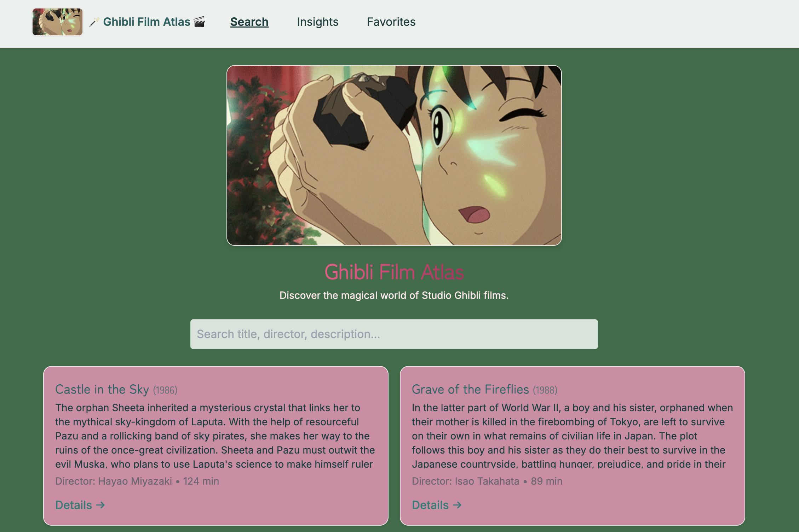

# Ghibli Film Atlas

Ghibli Film Atlas is a small React + Vite project where I learn how to fetch data from an API, show it in different pages, and do a little bit of extra analysis on top of the raw data. I used the Studio Ghibli API because I like the films and the dataset is friendly.

## Demo

  

## Features

- Search films by title, director, producer or words in the description.
- See details for a film on its own page.
- Mark favourite films (saved in the browser with localStorage so they stay after refresh).
- Simple “Insights” page that counts certain story motifs and shows average runtime by director.
- Reusable FilmCard component to not repeat the same markup.
- Loading / Error / Empty states so the UI doesn’t jump harshly.
- A basic in‑memory cache to avoid refetching the full film list every time.
- 404 page if someone goes to a route that doesn’t exist.
- Custom colour palette inspired by Ghibli scenes (set up with CSS variables + Tailwind).

## API

This project uses the public Studio Ghibli API hosted at
[`https://ghibliapi.vercel.app`](https://ghibliapi.vercel.app)【954988492755952†screenshot】. No API key is required. The app uses the following endpoints:

- `GET /films` – returns an array of all films【954988492755952†screenshot】.
- `GET /films/:id` – returns a single film by its ID.

See the [API documentation](https://ghibliapi.vercel.app) for more details.

## Data Transformations ("Action on Data")

I didn’t want to only list films, so I added a small “data action” part:

- I scan each description for simple keywords (like “forest”, “airship”, “war”) and label them as motifs.
- I count how many times each motif appears across all films.
- I group films by director and calculate the average runtime for each one.

It’s all fairly straightforward, but it shows I can reshape and aggregate data, not just print it.

## Setup

1. **Install dependencies.** In your project root:

```bash
npm install
```

1. **Run the development server.**

```bash
npm run dev
```

This will start Vite on a local port. Visit the URL printed in your terminal to view the app.

### Notes on Tailwind CSS

This project uses Tailwind CSS 3 (configured through a standard `postcss.config.js` with `tailwindcss` and `autoprefixer`). Tailwind’s base styles and utility classes are imported in `src/index.css`.

A custom palette inspired by Studio Ghibli films is defined as CSS variables; you can consume these values in your markup via arbitrary value syntax (e.g. `bg-[var(--color-mist-50)]`).

## Accessibility

- Skip link so keyboard users can jump straight to main content.
- `aria-live` on loading / error messaging.
- Clear focus outline using `:focus-visible` so tabbing around is obvious.
- Descriptive button labels for favourites.
- Proper landmarks (`header`, `nav`, `main`).

## Challenges & Solutions

| Challenge | Solution |
|-----------|----------|
| Invalid Tailwind plugin dependency (@tailwindcss/vite) broke install | Replaced with standard Tailwind + PostCSS setup |
| Bland visual design | used custom Ghibli palette via CSS variables + Tailwind theme extension |
| Repetitive loading / error UI | Extracted reusable `StatusBlocks` components |
| Need “action on data” | Added motif extraction, frequency aggregation & runtime averages |

## Known Issues / Limitations

- Motif detection is just naive keyword matching (some false positives / misses).
- Cache only lasts while the tab is open (memory only, not persistent).
- Only utility tests right now—no component tests yet.
- No dark mode toggle yet (on my list).
- Not yet deployed publicly yet.

## Future Enhancements (My Wish List)

1. Dark mode toggle (store preference in localStorage).
2. Component tests (search filter works, favourite toggle works, error retry works).
3. Tiny chart for motif counts.
4. Deploy to Netlify or Vercel and note build size / performance.
5. Error Boundary for unexpected crashes.
6. Maybe offline support later.

## Scripts

```bash
npm run dev       # start dev server
npm run build     # production build
npm run preview   # preview production build
npm test          # run unit tests (Vitest)
npm run lint      # run ESLint
```

## Deployment (Not Done Yet)

Plan: pick Netlify or Vercel, push main branch, let it auto-detect Vite. Then I’ll add the live URL here.

Live URL: _coming soon_

## Reflection & Presentation

Reflection: [`docs/reflection.md`](docs/reflection.md)

## License

This project is provided for educational purposes and carries no official
affiliation with Studio Ghibli or the Ghibli API. Feel free to reuse and
adapt the code for your own learning.
